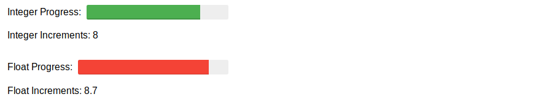

# Asyncio Progress Bars

## Simultaneous Progress Bar Incrementation

The following code cells demonstrate the use of Asyncio to have two tasks performing the incrementing of two Progress Bars in the Jupyter Notebook environment.

The first code cell printouts the elapsed time and the value of each task.

The second code cell combines the first cells asyncio logic with the ipywidgets IntProgress and FloatProgress.

The third code cell is the asyncio logic and the progress bars without the verbose comments. When the code is running the progress bars look like this:

This code is derived from the following references:

Why asyncio.run(main()) doesn't run on Jupyter:

https://stackoverflow.com/questions/55409641/asyncio-run-cannot-be-called-from-a-running-event-loop

https://blog.jupyter.org/ipython-7-0-async-repl-a35ce050f7f7

Python reference library:

https://docs.python.org/3/library/asyncio-task.html#coroutines-and-tasks

Possibly a better approach may be achieved with:

https://github.com/erdewit/nest_asyncio

Ian Stewart - 2019-10-04 - CC0
